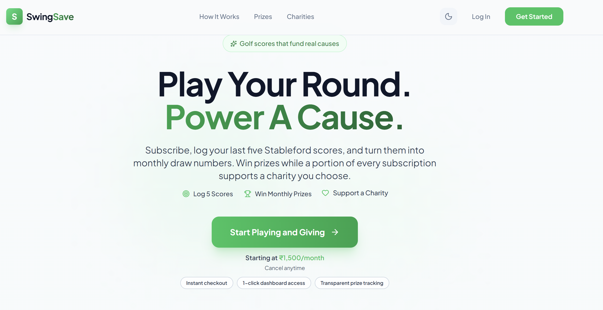
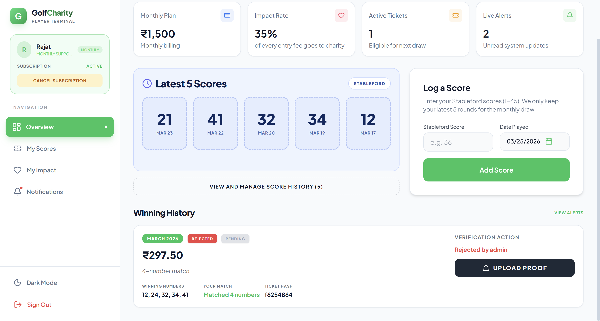
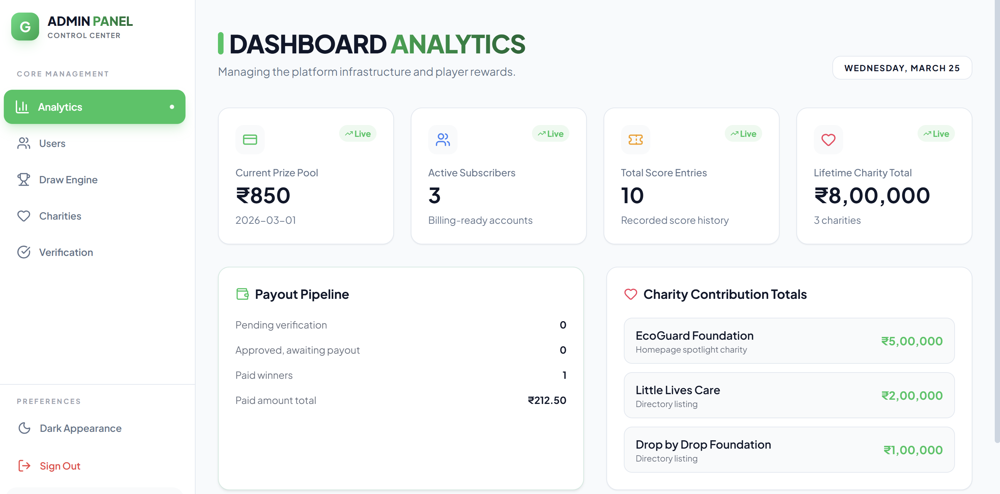

# Golf Charity Subscription Platform ⛳️❤️

A premium, full-stack platform for managing golf tournament subscriptions, charitable contributions, and prize draws. Features a state-of-the-art admin panel and player terminal with live analytics and score tracking.

## ✨ Key Features
-   **Player Terminal**: Modern, tabbed interface for players to log scores, track impact, and view winnings.
-   **Admin Control Center**: Comprehensive dashboard for managing users, draws, charities, and payment verifications.
-   **Automated Draw Engine**: Fair and transparent prize draw system with jackpot rollover logic.
-   **Charity Integration**: Customizable contribution percentages for every subscription.
-   **Dual-Theme UI**: Seamless light and dark mode support with a premium, glassmorphic aesthetic.
-   **Secure Authentication**: Multi-step signup flow with Supabase Auth and Google OAuth integration.


## 📸 Project Screenshots

### 🏠 Landing Page


### 👤 User Dashboard


### 🔑 Admin Panel


---

## 🛠 Tech Stack
-   **Frontend**: React 19, Vite, Tailwind CSS, Framer Motion, Lucide Icons.
-   **Backend**: Node.js, Express.
-   **Database**: Supabase (PostgreSQL).
-   **Payments**: Stripe & Razorpay Integration.

---

## 🚀 Local Setup Guide

### 1. Prerequisites
-   [Node.js](https://nodejs.org/) (v18 or higher)
-   [NPM](https://www.npmjs.com/)
-   [Supabase Account](https://supabase.com/)
-   [Stripe Account](https://stripe.com/) (for payments)

### 2. Clone the Repository
```bash
git clone <your-repo-url>
cd golf-charity-platform
```

### 3. Backend Setup
1.  Navigate to the server directory:
    ```bash
    cd server
    ```
2.  Install dependencies:
    ```bash
    npm install
    ```
3.  Configure environment variables:
    Create a `.env` file in the `server` folder based on `.env.example`:
    ```env
    PORT=5000
    SUPABASE_URL=your_supabase_url
    SUPABASE_SERVICE_ROLE_KEY=your_service_role_key
    STRIPE_SECRET_KEY=your_stripe_secret_key
    STRIPE_WEBHOOK_SECRET=your_stripe_webhook_secret
    RAZORPAY_KEY_ID=your_razorpay_key
    RAZORPAY_KEY_SECRET=your_razorpay_secret
    CLIENT_URL=http://localhost:5173
    ```

### 4. Frontend Setup
1.  Navigate to the client directory:
    ```bash
    cd ../client
    ```
2.  Install dependencies:
    ```bash
    npm install
    ```
3.  Configure environment variables:
    Create a `.env` file in the `client` folder based on `.env.example`:
    ```env
    VITE_SUPABASE_URL=your_supabase_url
    VITE_SUPABASE_ANON_KEY=your_supabase_anon_key
    VITE_API_URL=http://localhost:5000/api
    VITE_STRIPE_PUBLISHABLE_KEY=your_stripe_public_key
    ```

### 5. Running the Project
Open two terminals:

**Terminal 1 (Backend)**:
```bash
cd server
npm run dev
```

**Terminal 2 (Frontend)**:
```bash
cd client
npm run dev
```

---

## 🏗 Database Schema Setup
Execute the following SQL files in your Supabase SQL Editor:
1.  `supabase_schema.sql`: Core users and tables.
2.  `advanced_features_schema.sql`: Draws, winners, and charity tracking.
3.  `scores_schema.sql`: Golf score tracking.

**Note**: If you migration scripts like `migrate.js` or `fix-draws-schema.js` are available in the `server` directory, run them to sync the latest schema updates.

---

## ☁️ Deployment (Vercel)
For detailed instructions on deploying this full-stack project to Vercel, refer to our [Deployment Plan](file:///C:/Users/asus/.gemini/antigravity/brain/5041de07-d844-4256-8575-73def98e4735/implementation_plan.md).

1.  Connect your GitHub repo to Vercel.
2.  Set `client` as the root for the frontend project.
3.  Add all environment variables in Vercel settings.
4.  Ensure `VITE_API_URL` is set to your deployed backend URL or use the relative `/api` path if using a monorepo setup.

## 🤝 Contributing
Feel free to open issues or submit pull requests for features and improvements.
